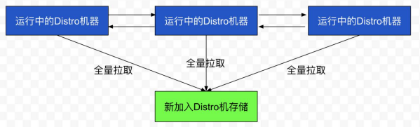

# 第6节.Nacos的一致性协议：Distro协议

## 简介

Distro协议是Nacos社区自研的一种AP分布式协议，是面向临时实例设计的一种分布式协议，其保证在某些Nacos节点宕机后，整个临时实例处理系统依旧可以正常工作。作为一种有状态的中间件应用内嵌协议，Distro保证了各个Nacos节点对于还亮注册请求的统一协调和储存。

## 设计思想

Distro协议的主要设计思想如下：

- Nacos 每个节点是平等的都可以处理写请求，同时把新数据同步到其他节点。
- 每个节点只负责部分数据，定时发送自己负责数据的校验值到其他节点来保持数据一致性。
- 每个节点独立处理读请求，及时从本地发出响应。

## Nacos为什么需要一致性协议

- Nacos 在开源支持就定下了⼀个目标，尽可能的减少用户部署以及运维成本，做到用户只需要⼀个程序包，就可以快速以单机模式启动 Nacos 或者以集群模式启动 Nacos。而Nacos 是⼀个需要存储数据的⼀个组件，因此，为了实现这个目标，就需要在 Nacos 内部实现数据存储。单机下其实问题不大，简单的内嵌关系型数据库即可；但是集群模式下，就需要考虑如何保障各个节点之间的数据⼀致性以及数据同步，而要解决这个问题，就不得不引入共识算法，通过算法来保障各个节点之间的数据的⼀致性。

- Distro 协议是阿里巴巴自研的⼀个最终⼀致性协议，而最终⼀致性协议有很多，比如Gossip（流行病协议）、Eureka 内的数据同步算法。而 Distro 算法是集 Gossip 以及 Eureka 协议的优点并加以优化而出来的，对于原生的 Gossip，由于随机选取发送消息的节点，也就不可避免的存在消息重复发送给同⼀节点的情况，增加了网络的传输的压力，也给消息节点带来额外的处理负载，而Distro算法引入了权威 Server 的概念，每个节点负责⼀部分数据以及将自己的数据同步给其他节点，有效的降低了消息冗余的问题。

## 数据初始化

新加入的 Distro 节点会进行全量数据拉取。具体操作是轮询所有的 Distro 节点，通过向其他的机器发送请求拉取全量数据。

在全量拉取操作完成之后，Nacos 的每台机器上都维护了当前的所有注册上来的非持久化实例数据。

## 数据校验

在 Distro 集群启动之后，各台机器之间会定期的发送心跳。心跳信息主要为各个机器上的所有数据的元信息（之所以使用元信息，是因为需要保证网络中数据传输的量级维持在⼀个较低水平）。这种数据校验会以心跳的形式进行，即每台机器在固定时间间隔会向其他机器发起⼀次数据校验请求。

⼀旦在数据校验过程中，某台机器发现其他机器上的数据与本地数据不⼀致，则会发起⼀次全量拉取请求，将数据补齐。

## 写操作

对于⼀个已经启动完成的 Distro 集群，在⼀次客户端发起写操作的流程中，当注册非持久化的实例的写请求打到某台 Nacos 服务器时，Distro 集群处理的流程图如下。

整个步骤包括几个部分（图中从上到下顺序）：

1. 前置的 Filter 拦截请求，并根据请求中包含的 IP 和 port 信息计算其所属的Distro 责任节点，并将该请求转发到所属的 Distro 责任节点上。
2. 责任节点上的 Controller 将写请求进行解析。
3. Distro 协议定期执行 Sync 任务，将本机所负责的所有的实例信息同步到其他节点上。

## 读操作：

由于每台机器上都存放了全量数据，因此在每⼀次读操作中，Distro 机器会直接从本地拉取数据。快速响应。

这种机制保证了 Distro 协议可以作为⼀种 AP 协议，对于读操作都进行及时的响应。在网络分区的情况下，对于所有的读操作也能够正常返回；当网络恢复时，各个 Distro 节点会把各数据分片的数据进行合并恢复。

## 总结：

Distro 协议是 Nacos 对于临时实例数据开发的⼀致性协议。其数据存储在缓存中，并且会在启动时进行全量数据同步，并定期进行数据校验。

在 Distro 协议的设计思想下，每个 Distro 节点都可以接收到读写请求。所有的Distro协议的请求场景主要分为三种情况：

1. 当该节点接收到属于该节点负责的实例的写请求时，直接写入。
2. 当该节点接收到不属于该节点负责的实例的写请求时，将在集群内部路由，转发给对应的节点，从而完成读写。
3. 当该节点接收到任何读请求时，都直接在本机查询并返回（因为所有实例都被同步到了每台机器上）。

Distro 协议作为 Nacos 的内嵌临时实例⼀致性协议，保证了在分布式环境下每个节点上面的服务信息的状态都能够及时地通知其他节点，可以维持数十万量级服务实例的存储和⼀致性。
